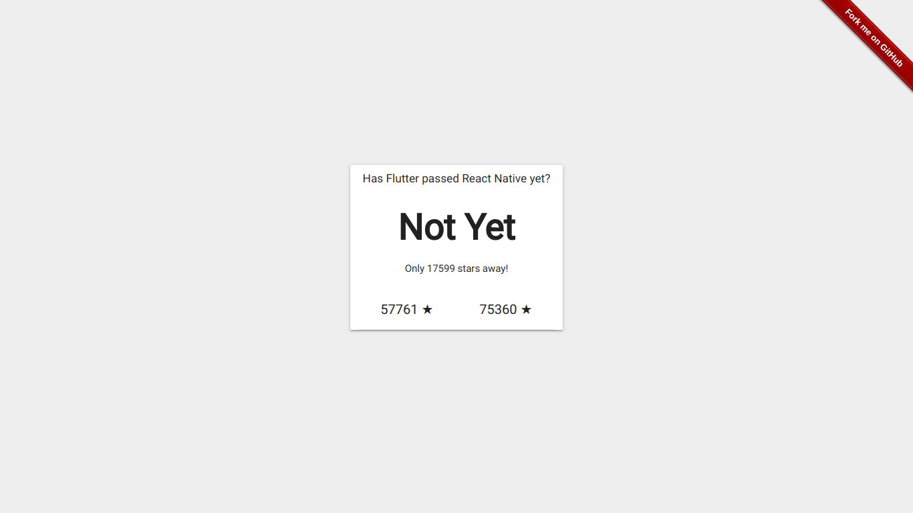

# [Has Flutter passed React Native yet?](https://piedcipher.github.io/hasFlutterPassedReactNativeYet/)

> :dart: A Dart Web App to compare :left_right_arrow: GitHub stars of Flutter and React Native



## Development Tools
- [Dart](https://webdev.dartlang.org/tools/sdk#install)
- [Web Storm](https://www.jetbrains.com/webstorm/)

## Development
```
$ git clone https://github.com/piedcipher/hasFlutterPassedReactNativeYet.git
$ cd hasFlutterPassedReactNativeYet
$ pub get && webdev run
```

## Building (JavaScript)
```
$ pub global run webdev build --output=web:build
$ cp -t hasFlutterPassedReactNativeYet/ web/index.html web/style.css web/main.dart.js
```

## Todo
- [ ] Visual Polish
- [ ] Refresh Button
- [ ] Deployment on Netlify

## Inspired By
[hasvuepassedreactyet](https://github.com/stursby/hasvuepassedreactyet) Created by [Charlie Hield](https://github.com/stursby/)

## Credits
Created from templates made available by Stagehand under a BSD-style
[license](https://github.com/dart-lang/stagehand/blob/master/LICENSE).
